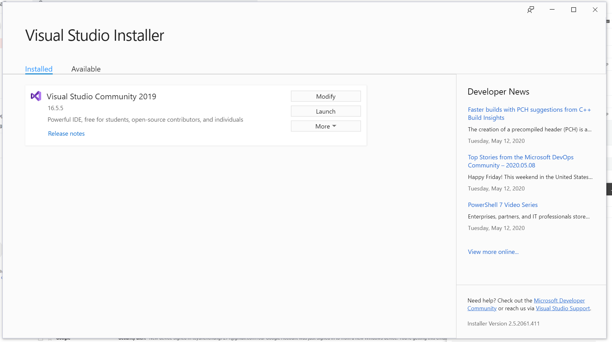
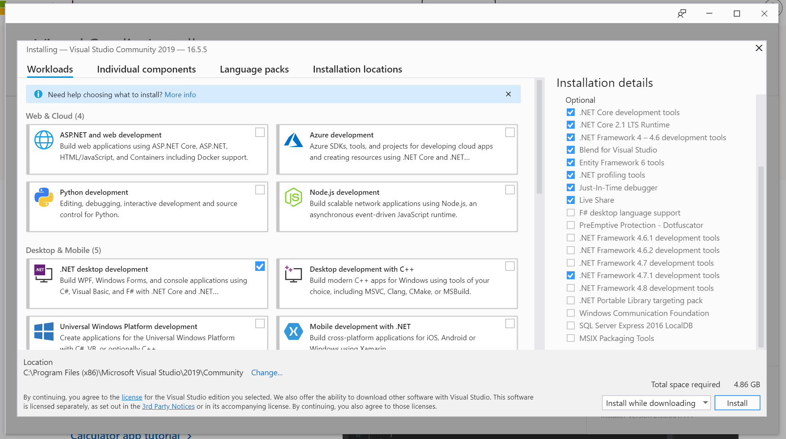

# MealTimeMS
Mass spectrometry-based proteomics technologies are the prime methods for the high-throughput identification of proteins expressed in complex biological samples. Nevertheless, mass spectrometry’s technical limitations still hinder its ability to identify low abundance proteins in complex samples. Characterizing such proteins is essential to provide a comprehensive understanding of the biological processes taking place in a sample. Still today, a large part of the mass spectrometry-based proteomics performed use a data-dependent approach that favors the acquisition of mass spectra and detection of proteins of higher abundance. Combined to the fact that the computational identification of proteins from mass spectrometry data is typically performed after mass spectrometry data acquisition, large numbers of mass spectra are redundantly collected from the same abundant proteins and little to no mass spectra are acquired for proteins of lower abundance. To address this problem, we propose a novel supervised learning algorithm, MealTime-MS, that identifies proteins in real-time as mass spectrometry data is acquired and prevents the further data acquisition related to confidently identified proteins to improve the identification sensitivity of low abundance proteins. 
The current version of this application only supports simulation of data acquisition and exclusion, it does not support in-instrument exclusion. 

Instructions to running MealTimeMS DEMO with the Example Dataset at the bottom of this README.

## Compiling MealTimeMS
*Preprocessor directives: *SIMULATION*
*Use Preprocessor directive *WIN32* if compiling on a x86 computer
Instructions for compiling using [Visual Studio 2019](https://visualstudio.microsoft.com/downloads/), free community version: 

The Program requires the .NET platform. and .NET Framework 4.7.1.
When installing visual studio for the first time (Or re-open the Visual Studio Installer), click on "Modify" in the Visual Studio Installer screen, 

In the modification page, make sure ".NET desktop development" is checked, and select ".NET Framework 4.7.1 development tools" on the right hand side. Press Modify on the bottom right to apply.

Compiling MealTimeMS for x64 platform:
1. Clone or download this GitHub repository
2. Open MealTimeMS.sln in the downloaded folder with Visual Studio.
3. In the solution explorer window, right click on Solution 'MealTimeMS', click "Properties"
4. In the solution property pop-up window, click on the configuration properties tab, set "Configuration" to Release, and set "Platform" to "x64", check the "Build" checkbox. Click on Apply, then click OK to close the window.
5. In the solution explorer window, right click on the "MealTimeMS" project file, select Properties
6. In the new window, go to the Application tab, change the target framework to ".NET Framework 4.7.1". Set Output Type as "Console Application". 
7. In the Build tab, type "SIMULATION" to in the "Conditional compilation symboles" (type "SIMULATION,WIN32" if compiling for x86 version). Note the file path listed in the "Output path" text box, the compiled MealTimeMS executable can be found in that folder when built. Hit Ctrl+S to save these settings
8. Right click on the 'Solution MealTimeMS' icon in the solution explorer and Build Solution
9. If build successful, the MealTimeMS.exe command line application could be found in the output folder aforementioned. 
eg. The default output path is under "bin\x64\Release\", so the MealTimeMS.exe can be located at [The folder of the MealTimeMS source code folder downloaded from Github]\MealTimeMS\bin\x64\Release*

___

## Files and software required to run MealTimeMS
1. A protein sequence database file in FASTA format.
2. A parameter file for [Comet](http://comet-ms.sourceforge.net/) sequence database search, 2019 version.
3. Install [Trans-Proteomic Pipeline](http://tools.proteomecenter.org/software.php)(TPP).
4. A spectral data file in .ms2 format used to simulate data acquisition and exclusion. Can be converted from .raw or .mzML format to .ms2 formate using [ProteoWizard's](http://proteowizard.sourceforge.net/) msconvert app.
5. A spectral data file in .ms2 format used to train the MealTimeMS' logistic regression classifier.
6. RTCalc coefficient file. This is a trained RTCalc model coefficient, used to predict peptide retention time.
7. MealTimeMS.params file, can be generated by MealTimeMS, read below for instructions.
An example dataset of all these files could be found under the ExampleDataset folder. 

### Converting spectral data file from .raw to .ms2 using [ProteoWizard's](http://proteowizard.sourceforge.net/) msconvert
1. Locate msconvert.exe in the Proteowizard installation folder.
2. In command line, run `msconvert.exe <data.RAW> --ms2 -o <Output folder>` 

___

## Running MealTimeMS
This is a command line application.
There are 3 usages
1. Creating a MealTimeMS parameter file.
2. Training a logistic regression classifier (lr) and creating a lr model coefficient file necessary for data acquisition simulation using MealTimeMS.
3. Simulating data acquisition of a MS experiment.

___

### A. Creating and using a MealTimeMS parameter file
1. In commandline, run `MealTimeMS.exe -p <workplace directory>`
2. A parameter file would be generated in the *<workplace directory>* named MealTimeMS.template.params

Most parameters are will be explained below. However, please note that a coefficient file (*RTCalcCoefficient*) of a trained RTCalc model will be required. 
The file could be generated with TPP, and the unit used in the training should be in seconds. The training is beyond the scope of this project. 
A new RTCalc Coefficient file is required for an experiment using a different column type and liquid chromatography gradient.
___

### B. Training the classifier for MealTimeMS
This command trains the classifier and generates a logistic regression classifier coefficient file.

`MealTimeMS.exe -train <workPlaceDirectory> <MS2 file> <Protein Fasta database> <Comet parameter file>`
The trained coefficient file will be titled "*.ClassifierCoefficient.txt", located in the output folder you specified in the workplace directory.

___

### C. Setting up and running data acquisition simulation with MealTimeMS
There are 4 exclusion methods to choose from: 
0: No Exclusion. 1: MealTimeMS. 2: Heuristic exclusion. 3: CombinedExclusion
Indicate the desired exclusion method in the MealTimeMS.params file, under the *ExclusionMethod* parameter.
Fill in the other parameters. Note a LogisRegressionClassiferSavedCoefficient file is required to run MealTimeMS or CombinedExclusion.

#### Setup specification for the *ExperimentParameters* section in the MealTimeMS.params file for each exclusion method:
0. No Exclusion: Leave the *ExperimentParameters* as it is or set as -1, the values will not be used
1. MealTimeMS: ppmTolerance, retentionTimeWindowSize, and LogisticRegressionDecisionThreshold are required.
2. Heuristic exclusion: ppmTolerance, retentionTimeWindowSize, XCorr_Threshold, NumDBThreshold required.
3. CombinedExclusion: All *ExperimentParameters* required.

Note: Only one exclusion method can be run at a time. However, if multiple values for a parameter is provided, eg:
`ppmTolerance = 5.0,10.0`
`retentionTimeWindow = 1.0,2.0`
The software will run all combinations of the parameters (4 simulations in this case) using the specified exclusion method.

#### Starting the simulation
Run the program with the following command:
`MealTimeMS.exe -run [options] <workPlaceDirectory> <paramsFile>`

Options:
-l [Info|Debug]  #Defaults to Info
-r [int] # a positive integer r specifying the frequency of simulation progress reporting. Program displays a message after progressing every r ms2 spectra.

#### After the simulation finishes
After the program finishes, there will be several files and sub-folders inside the output folder with your specified Experiment Name:
*ExperimentName_Summary.txt: A tsv containing the information of the simulation, namely the percentage of MS2 spectra used/excluded, and the number of proteins identified
*ExperimentName_PeptideRTTime.txt: If *No Exclusion* exclusion method was selected, a list of peptide with their observed retention time (minutes) is generated. Can be used in Special Simulation, see special simulation section. 
*preExperimentFiles folder: Inside the folder contains several files that can be reused as Precomputed Files to reduce the overhead of the program, see section below. 
___

### D. Precomputed Files
Before a simulation, MealTimeMS takes a while to generate some files necessary for the simulation such as retention time prediction of peptides.
The result of these processes are the same when you re-run the program using different exclusion methods, so we can reuse some of the files to skip these processes. 
You can provide the below three files in the MealTimeMS.params file after you have already run the program once before. 
**This procedure should only be used if you are using the same Fasta database, Comet search parameter, .ms2 spectral file, and the same PreExperimentSetup parameters**
Note: This section is purely used to speed up the program preprocessing if you are re-runing the simulation multiple times. These files are not required.

1. RTCalcPredictedPeptideRT: 
⋅⋅⋅This is a file generated by RTCalc, containing a list of all possible peptides generated from the protein database along with their predicted retention time.
⋅⋅⋅If you run the simulation once before, this file could be found at "Output/ExperimentName/preExperimentFiles/*_rtOutput.txt"
2. IDXDataBase:
⋅⋅⋅This is required for the real-time Comet database search.
⋅⋅⋅If you run the simulation once before, this file could be found at "Output/ExperimentName/preExperimentFiles/*_decoyConcacenated.fasta.idx"
3. OriginalCometOutput:
⋅⋅⋅The database search result used for 
⋅⋅⋅If you run the simulation once before, this file could be found at "Output/ExperimentName/preExperimentFiles/*.pep.xml"
___

### E. Special Simulation
To investigate how a more accurate peptide retention time prediction could improve MealTimeMS's performance, measured retention time, rather than predicted retention time generated by RTCalc, is used to facilitate peptide exclusion.
In the MealTimeMS.params's *SpecialSimulation* section, a file could be provided under *MeasuredPeptideRetentionTime* that includes a list of peptides with their observed retention time, these values will be used to facilitate exclusion.
⋅⋅⋅To obtain this file, run a simulation with No Exclusion. In the output folder, a file named "*_PeptideRTTime.txt" could be found".
AmountPerturbation: A double value could be provided to add a perturbation around the measured retention time. 

___
## Running MealTimeMS with the Example Dataset
1. To compile MealTimeMS, read and follow the "*Compiling MealTimeMS*" section of this README.md. Alternatively, an already-compiled version of MealTimeMS.exe is located in MealTimeMS/MealTimeMS/bin/x64/Release/ folder of this repository. Download the Release folder or the entire repository if you choose the latter option. 
2. Download and install [Trans-Proteomic Pipeline](http://tools.proteomecenter.org/software.php)(TPP).
3. Download spectral data *MS_QC_120min_PreviouslyAcquiredDataset.raw* from [PRIDE repository](https://www.ebi.ac.uk/pride/archive/projects/PXD017673/private) with login credentials provided in the paper "MealTime-MS: A Machine Learning-Guided Real-Time Mass Spectrometry Analysis for Protein Identification and Efficient Dynamic Exclusion".
4. Convert *MS_QC_120min_PreviouslyAcquiredDataset.raw* to .ms2 format using *msconvert* from [ProteoWizard](http://proteowizard.sourceforge.net/) or other file conversion software. (See instructions above for [file conversion](https://github.com/LavalleeAdamLab/MealTimeMS/blob/master/README.md#L35))
5. Download the ExampleDataset folder from this gitHub repo if not already downloaded.
6. In the MealTimeMS.example.params file, replace all the file paths that corresponds to the various files in the ExampleDataset folder with their respective absolute file path on your computer. And set the "MS2SimulationSpectraFile = " to the file path of the .ms2 file acquired in step 2. 
7. A trained MealTimeMS logistic regress coefficient file is already provided in the ExampleDataset folder named "MS_QC_240min_Trained_ClassifierCoefficient.txt". It is trained using spectral data from a 240min HEK293 analysis experiment, MS_QC_240min_PreviouslyAcquiredDataset.raw. This file could also be found in the PRIDE repository. (Read *Training the classifier for MealTimeMS* section to reproduce the training process. However it is not required to run this demo)
8. Specify the desired exclusion method under the "ExclusionMethod" parameter in the MealTimeMS.example.params file  
9. Start simulation of an data acquisition experiment with MealTimeMS using 
`MealTimeMS.exe -run -r 100 <workPlaceDirectory> <MealTimeMS.example.params>`
___

For any questions regarding compiling or running MealTimeMS, contact Yun-En Chung at ychun060@uottawa.ca
